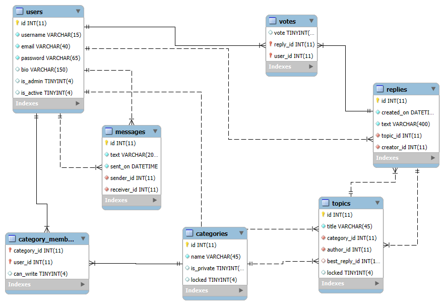

# Forum-App
This is the first project developed during the Web module of the Telerik Academy Alpha Python program.

The application is a web-based forum that enables users to share knowledge, experiences, and opinions across various discussion topics. It includes user authentication, topic management, commenting, messaging, and administrative controls.

-------------------------------------------------------------------------

## 🧭 Table of Contents

- [About the Project](#about-the-project)
- [Team Members](#team-members)
- [Tech Stack](#tech-stack)
- [Features](#features)
- [Installation](#installation)
- [Architecture Overview](#architecture-overview)
- [Database Design](#database-design)
- [API Documentation](#api-documentation)
- [Testing](#testing)
- [Future Improvements / Roadmap](#future-improvements--roadmap)

---

## Team Members

- **Boris Tsonkov**
- **Petar Pavlov**
- **Dilyana Bozhinova**

---

## Tech Stack

- **Frontend:** HTML, CSS
- **Backend:** FastAPI (Python)
- **Database:** MariaDB
- **Tools & Libraries:** 
   - FastAPI  
   - JWT  
   - Jinja2    
   - python-dotenv  
   - MariaDB Python driver (`mariadb`)  
   - Pydantic  
   - Uvicorn  
   - HTTPX  
   - python-multipart  

---

## Features

###  Authentication

- **User Registration**
  - Allows new users to register with unique credentials; username, email and password are required.
- **User Login**
  - Authenticates users and returns a JWT token for secure access.

###  Admin Access

- **Create & Manage Categories**
  - Admins can create, lock, and toggle visibility of categories.
- **Manage User Permissions**
  - Grant or revoke read/write access to private categories.
- **View Privileged Users**
  - List users with special access to a category and their roles.
- **Moderate Topics**
  - Lock topics to prevent further replies.

###  Category and Topic Interactions

- **Create Topics**
  - Authenticated users can post topics in the choosen category.
- **Create Replies**
  - Users can post replies to specific topics.
- **View Topics and Replies**
  - Browse all topics and see replies under each.
- **View Categories**
  - Lists all categories, with filtering by category and support for pagination/search.
- **Private Categories**
  - Access controlled by admin-granted permissions.
  - Only admins and category members can access a private category.

###  Messaging

- **Send Messages**
  - Authenticated users can message others with plain text content.

###  Voting and Feedback

- **Upvote/Downvote Replies**
  - Authenticated users can vote once per reply and change their vote later.
- **Choose Best Reply**
  - Topic authors can select one reply as the “best” answer.

---

## Installation

1. **Clone the repository:**  
   `git clone https://github.com/Forum-App-web-module/Forum-App.git`  
   `cd forum-app`

2. **(Optional, Recommended) Create and activate a virtual environment:**  
   `python -m venv venv`  
   `.venv\Scripts\activate.ps1` 

3. **Install the required dependencies:**   
   `pip install -r requirements.txt`  
   *If additional dependecy is installed use the bellow command to update the file*  
   *pip freeze > requirements.txt*

4. **Set up your environment variables:**  
    Copy the environment file:  
   `cp key_example.env .env`  
    Fill in the required values (e.g., database credentials, secret keys)

5. **Run the application**:  
   `uvicorn main:app --reload`  
   *Use `--port {port_number}` if you want to run the app on a different port (default is `8000`)*

## Architecture Overview

## Database Design

### The schema covers the following key entities

- **users** – stores user data such as credentials, status (active or not), role (admin or not), bio
- **categories** – holds categry info - id, name, lock and privacy status
- **topics** – created by users under a category; can be locked or have a “best reply”.
- **replies** – comments made by users under topics; can be voted and marked as best.
- **votes** – tracks upvotes/downvotes on replies by users.
- **messages** – handles direct messaging between users.
- **category_members** – manages access to private categories.

## N-Tier Architecture

## API Documentation

## Testing
   The tests are written using the `unittest` framework.
   All tests are located in Forum-App/tests/  
### Coverage:  
   - user authentication and authorization  
   - category, topic, reply logic  
   - internal service layer functionality  
   - API routers  

### Tests execution:  
    - python -m unittest discover Forum-App/tests

## Future Improvements / Roadmap

---

📘 README Structure for a Web Project
1. Project Title and Description  
What to include:

- Project name.

- A brief summary of what the project does.

- Its main features or goals.

- Target users or use cases.

2. Table of Contents (optional but useful for longer READMEs)  
What to include:

- Quick navigation to sections like Installation, Usage, Architecture, etc.

3. Team Information  
What to include:

- Names of the team members and their roles.

- Optionally, include links to GitHub or LinkedIn profiles.

4. Tech Stack  
What to include:

- Languages, frameworks, and tools used (e.g., React, Node.js, PostgreSQL).

- Brief explanation of why certain tools were chosen, if relevant.

5. Features  
What to include:

- A bullet list or short description of the core features (e.g., user authentication, thread posting, comment system).

- Indicate if any features are planned or in development.

6. Installation and Setup Instructions  
What to include:

- Prerequisites (Node.js, PostgreSQL, etc.).

- How to clone the repo.

- Steps to run the project locally.

- Any environment variables that need to be set.

7. Architecture Overview  
What to include:

- A high-level explanation of how the app is structured (frontend/backend/services/layers).

- Include your services and layers diagram here.

- Describe how different components interact.

8. Database Design  
What to include:

- Explanation of the database schema and relationships.

- Insert your database diagram image here.

- Mention any migrations or seed data used.

9. API Documentation  
What to include:

- List of main endpoints (GET, POST, etc.).

- Expected request/response formats.

- Authentication or security notes, if relevant.

10. Testing  
What to include:

- Testing tools or libraries used.

- How to run the tests.

- Any notable coverage or testing strategy details.

11. Future Improvements / Roadmap  
What to include:

- Planned features or upgrades.

- Potential refactors or architectural changes.

- Deployment

13. Challenges and Learnings  | Presentation
What to include:

- Technical or team-related challenges faced.

- Key lessons learned during development.

